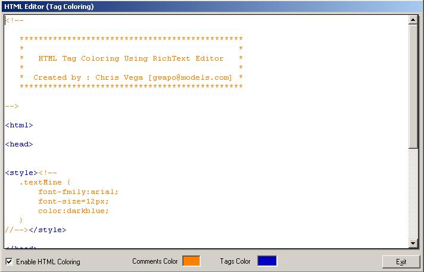



## HTML Tag Coloring \(Real\-Time Coloring\)

### Description

Fastest HTML Tag/Coment Coloring Procedure for RichTextBox Control, with less flickering on realtime!!!

Plus a small trick that added-shadowing effect on RichTextBox Control, Download it now and

Rate this code...

Thanks, this is only a part of a bigger Application, coming up next...
 
### More Info
 

             |
---                |---
**Submitted On**   |2001-10-11 03:28:30
**By**             |[Chris Vega](https://github.com/Planet-Source-Code/PSCIndex/blob/master/ByAuthor/chris-vega.md)
**Level**          |Advanced
**User Rating**    |4.4 (40 globes from 9 users)
**Compatibility**  |VB 5\.0, VB 6\.0
**Category**       |[Internet/ HTML](https://github.com/Planet-Source-Code/PSCIndex/blob/master/ByCategory/internet-html__1-34.md)
**World**          |[Visual Basic](https://github.com/Planet-Source-Code/PSCIndex/blob/master/ByWorld/visual-basic.md)
**Archive File**   |[HTML Tag C2849510112001\.zip](https://github.com/Planet-Source-Code/chris-vega-html-tag-coloring-real-time-coloring__1-27985/archive/master.zip)

